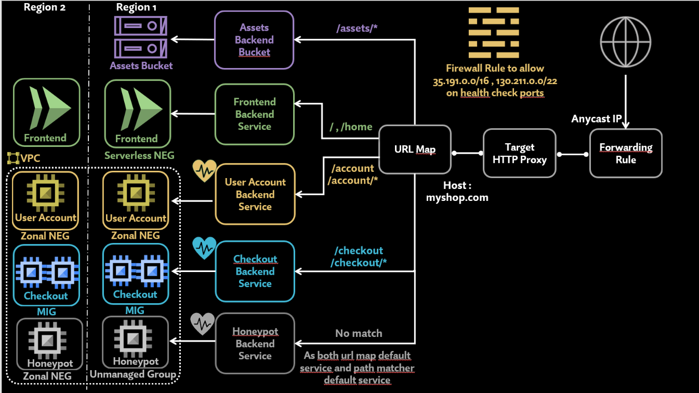

# GCP Global Load Balancer Lab

A comprehensive hands-on lab to learn and practice Google Cloud Platform's Global Load Balancer (GLB) and its routing capabilities.



## Overview

This lab provides practical experience with GCP's Global Load Balancer, covering load balancing strategies, routing logic, and real-world deployment scenarios.

## Video Tutorial

Follow along with our detailed video guide to complete this lab:

📺 [Watch the Complete Tutorial](https://www.youtube.com/watch?v=gofeXFQ7sFA)

## Getting Started

- Clone or download this repository
- Follow the video tutorial linked above
- Execute the infrastructure scripts in the order specified in the video.
- Deploy and test the load balancing configuration

## Architecture

This lab includes:
- **Frontend**: Python application with containerization
- **Checkout Service**: Backend service
- **Global Load Balancer**: Routing and load distribution
- **Honeypot**: Security monitoring
- **Networking**: VPC, subnets, and NAT configuration
- **Firewall**: Security rules and policies

## Structure

```
├── frontend/          - Frontend application
├── checkout/          - Checkout service
├── honeypot/         - Security monitoring
├── user-account/     - User account service
├── assets/           - Storage and assets
├── firewall.sh       - Firewall configuration
├── loadbalancer.sh   - Load balancer setup
├── url-map.yaml      - URL routing configuration
└── vpc-subnets-nat.sh - Network infrastructure
```

## Requirements

- Google Cloud Platform account
- `gcloud` CLI installed and configured
- Docker (for container images)
- Bash shell environment
